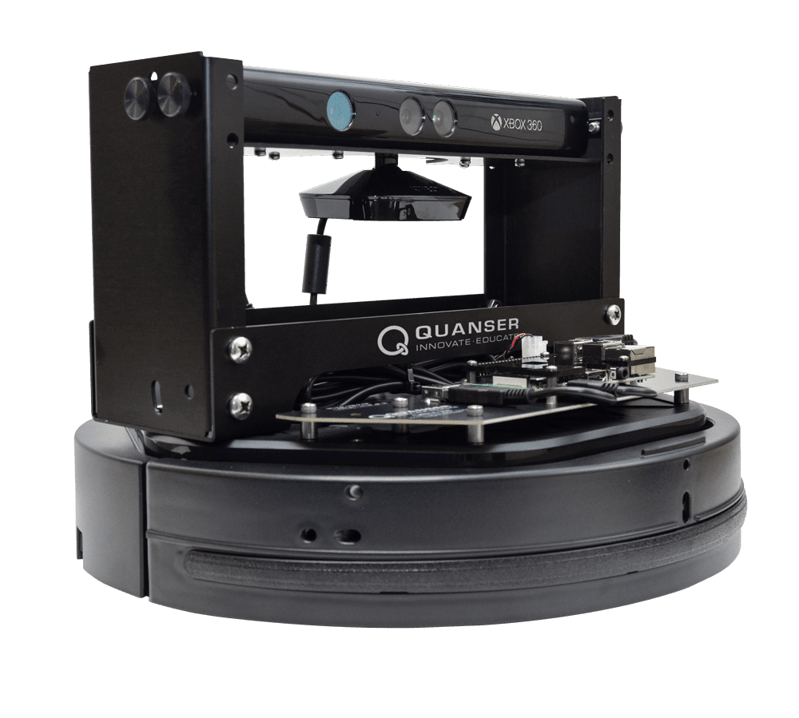
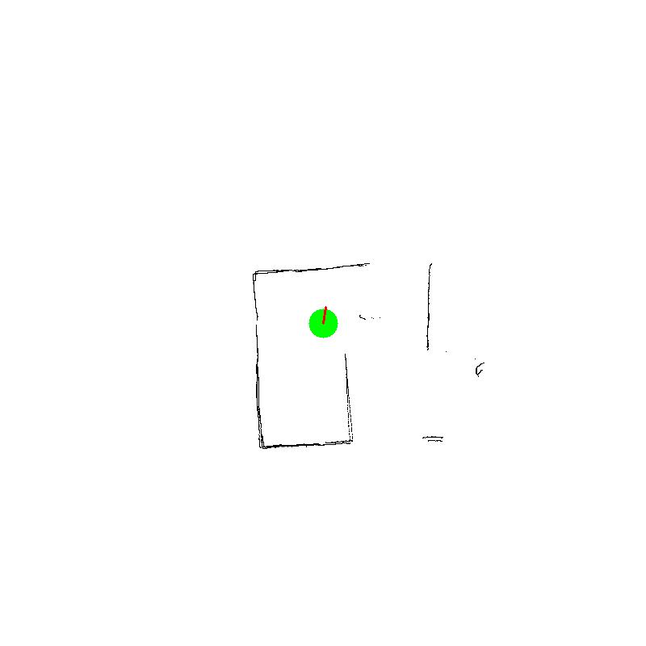
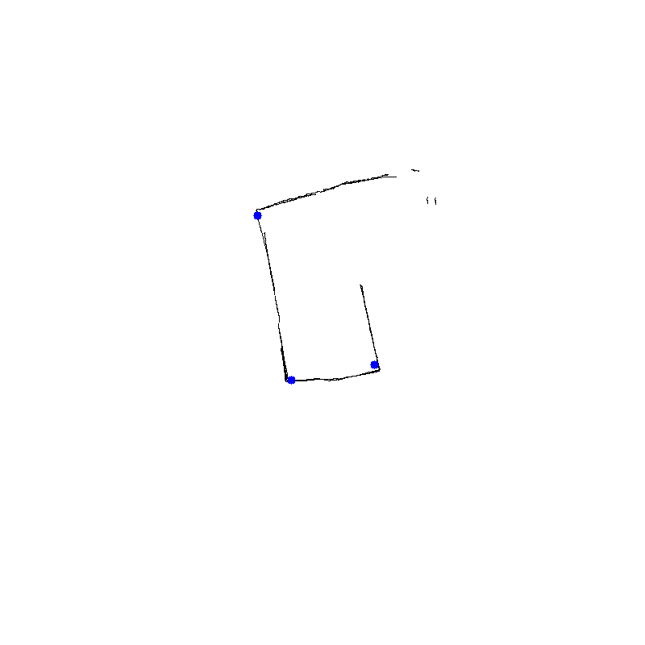

# Quanser SLAM Navigation Project

## Overview
This project demonstrates SLAM (Simultaneous Localisation and Mapping) using a **Quanser robot** equipped with a depth/color camera and sensors. The goal was to localise the robot using Monte Carlo particle filtering and autonomously navigate through a mapped environment using the A* pathfinding algorithm.

## Hardware


- **Platform:** Quanser QBot (based on iRobot Create)
- **Sensors:** Depth + color camera (e.g., Kinect/Xbox 360)
- **Processing:** Onboard Raspberry Pi running Python

## Objectives
- Build a 2D map of the environment
- Identify a unique landmark
- Localise using particle filter
- Plan and follow an A* path to a user-selected open space

## Key Algorithms
- **Image Processing**: OpenCV-based segmentation for obstacle and landmark detection
- **Localisation**: Monte Carlo particle filter for pose estimation
- **Pathfinding**: A* algorithm for generating obstacle-free paths
- **Control**: PID loop for movement correction

## Mapping Output


- The green dot indicates the bot's pose
- 
## Landmark Detection


- Blue dots indicate detected corners/landmarks in the environment

## Repository Structure
```
engmt380_slam-main/
├── engmt380_slam-main/
│   ├── README.md
│   ├── SlambotHD_readme.txt
│   ├── assignment3.py
│   ├── astar.py
│   ├── bot_math.py
│   ├── compare_maps.py
│   ├── cone_extraction.py
│   ├── distance.py
│   ├── integrated_particle_filter.py
│   ├── main.py
│   ├── map.png
│   ├── movement.py
│   ├── next_locations.py
│   ├── particle_main.py
│   ├── particle_test.py
```

## Acknowledgements
- Quanser platform and documentation
- OpenCV, NumPy, and Python libraries for development
